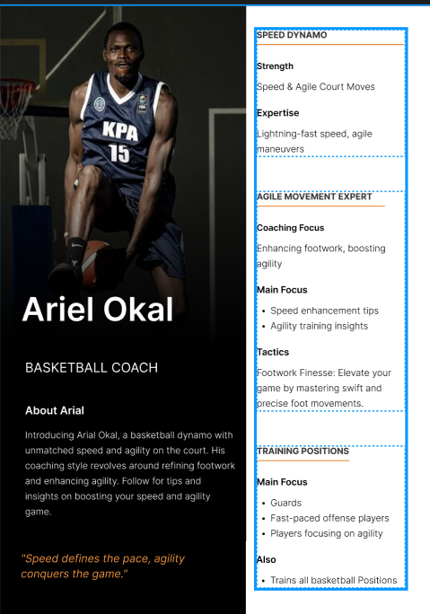
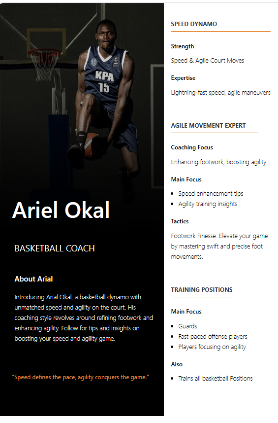

# Ariel Poster

This project is a recreation of the **Ariel Profile Poster (No. 3)** from the provided Figma design using React and Tailwind CSS.

## Poster Chosen

**Poster:** Ariel Profile Poster (No. 3)

## Running the Project

Clone the repository, install the dependencies, and start the development server:

```bash
npm install
npm run dev
```

## Poster Comparison

### Original Poster



### Final Poster

